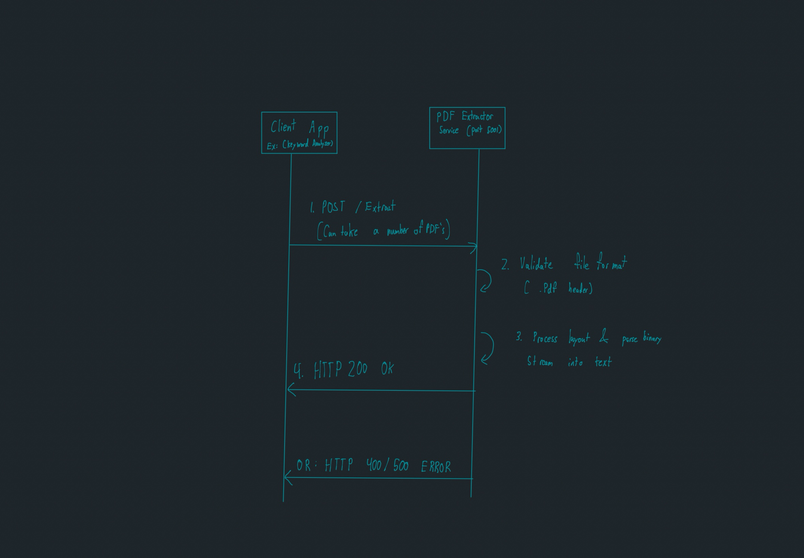

# PDF-to-Text Extraction Microservice

## Overview
This microservice provides automated text extraction from PDF documents. Built with Python and Flask, it acts as an independent utility within our group project ecosystem. Its primary function is to support the **Keyword Analyzer** application by allowing users to upload resumes or cover letters directly and receiving the raw, structured text strings back for analysis.

## Communication Contract

> **CRITICAL CONTRACT NOTICE:** Microservices and main applications in this ecosystem can rely on these exact endpoints, request parameters, and response structures without risk of breaking changes.
---

## How to Programmatically REQUEST Data

To request text extraction, send an HTTP `POST` request to the `/extract` endpoint. The request payload must be encoded as `multipart/form-data` and include the binary PDF data.

### Request Details
* **Endpoint:** `/extract`
* **Method:** `POST`
* **Headers:** `Content-Type: multipart/form-data`
* **Body Parameters:**
  * `file`: (Required) The binary data stream of the PDF file.

### Example Call (Python Client)
This script scans a local directory named `read_pdf`, automatically grabs any PDF files found, and streams them to the running microservice:

```python
import os
import requests

# Configuration
TARGET_FOLDER = "read_pdf"
URL = "[http://127.0.0.1:5001/extract](http://127.0.0.1:5001/extract)"

# Ensure the local target folder exists
if not os.path.exists(TARGET_FOLDER):
    os.makedirs(TARGET_FOLDER)

# Find all PDF files in the directory
pdf_files = [f for f in os.listdir(TARGET_FOLDER) if f.lower().endswith('.pdf')]

if not pdf_files:
    print(f"Please drop a PDF into the '{TARGET_FOLDER}' folder to test.")
else:
    for filename in pdf_files:
        pdf_path = os.path.join(TARGET_FOLDER, filename)
        print(f"Sending {filename} to microservice...")
        
        try:
            # Open and stream the file in binary mode
            with open(pdf_path, 'rb') as f:
                files = {'file': f}
                response = requests.post(URL, files=files)
            
            # Request payload has been handed off; proceed to receive step
            handle_response(response, filename)
            
        except requests.exceptions.ConnectionError:
            print("Connection Error: Ensure pdf_service.py is running on port 5001.")
            break
```
## How to Programmatically RECEIVE Data

The microservice processes incoming valid file payloads and returns structured data in **JSON** format alongside explicit standard HTTP status codes.

### Successful Response (`200 OK`)
When a valid PDF is successfully parsed, the service returns an HTTP `200` status. The JSON body contains a `status` key and a `text` key holding the complete extracted plain text payload.

**Example JSON Output:**
```json
{
  "status": "success",
  "text": "Calvin Grabowski\nTechnical Skills\nLanguages: C++, Python, C..."
}
```

Error Responses
To prevent client crashes, the service gracefully intercepts file formatting errors and returns meaningful JSON diagnostic blocks:

* Invalid File Type (400 Bad Request): Returned if a non-PDF file format is uploaded.

* Malformed Data/Server Error (500 Internal Server Error): Returned if the PDF is corrupted or unreadable.

Example Error JSON Output:

```json
{
  "status": "error",
  "error": "Invalid file format. Please upload a valid PDF document."
}
```

Example Receiving Handling (Python Client)

```Python
def handle_response(response, filename):
    """Processes the incoming JSON payload received from the microservice."""
    if response.status_code == 200:
        data = response.json()
        extracted_text = data.get('text', '')
        print(f"--- Extraction Successful ({filename}) ---")
        # Print a sneak-peek preview of the first 200 characters received
        print(extracted_text[:200] + "...\n")
    else:
        # Handle failures gracefully based on the error JSON contract
        error_data = response.json()
        print(f"Server Error ({response.status_code}): {error_data.get('error')}")
```
---

### UML Sequence Diagram
The diagram below illustrates how a client application (or the local test batch script) programmatically interacts with this microservice over a local or network port:

